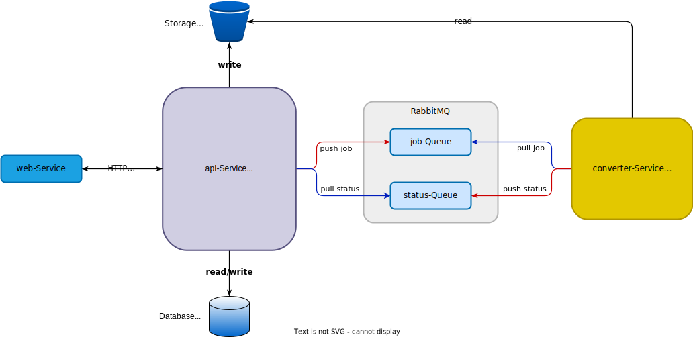
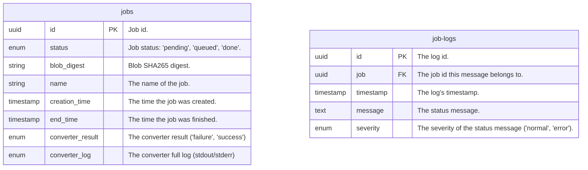

# Architecture

The following describes the architecture of the components `api`, `converter`
and the involved two queues `jobs` and `status`.

## Component Diagram

The application in the backend consists of an `api` service which pushes `job`s
into `jobs`-queue. The `converter` service on the other end consumes the jobs on
the `jobs` queue and sends status updates through the queue `status`. The `api`
service consumes status updates on the `status`-queue and persists them in the
database.

## Database Tables

The data base persists jobs in the `jobs` table and job logs (received on the
`status`-queue) in the `job-logs` table.

