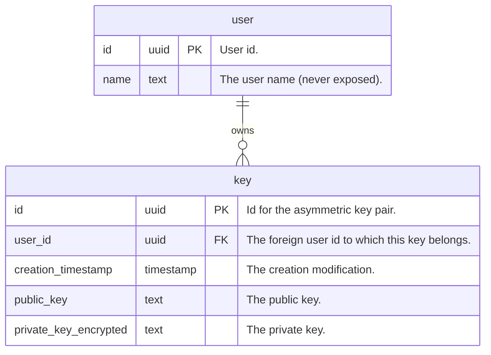

# Architecture

The following describes the architecture of the components `api` and the
involved other parts it interacts with. Not implemented parts in all diagrams
are marked with: ⚒ .

## Component Diagram

<div style="text-align:center">
    
</div>

Since the backend handles a very vulnerable part (maybe part of a larger
application), namely storing asymmetric keys, it is crucial to employ the
strictest security measures possible. The following interactions happen:

1. The `client` communicates with the backend over `HTTP/2.0` requests to a REST
   API (Using `gRPC` is overkill and couples too strongly). The connection
   should be TLS encrypted (version >=`1.2`).

   - The client should only store the keys it interacts with in physical memory
     and only decrypt the private key when really needed. We treat the CLI
     application here as a client which might have the same runtime life-time as
     a corresponding web application.

   - The client does not log in anyway the key pairs it interacts with.

   - In case of the CLI:

     - it handles exit codes properly (an absolutely horrifiying example would
       be JFrogs Artifactory CLI `jf`).
     - it tries to either prompt the user to enter the passphrase for the
       private key generation or it reads it from a file (argument
       `--passphrase-file <file>`) to avoid leaking anything to the process
       listing (e.g. `ps`).
     - Passphrases need to be
       [strong (see `validate_passphrase`)](../components/client/src/generate.rs#L).

   - It generates asymmetric keys as
     [described here](#asymmetric-key-generation).

2. The entry point in the backend consists of a `firewall` [⚒] which handles:

   - threat prevention (e.g.against denial-of-service (DDoS) attacks)
   - access control (VPN etc. (?))
   - application layer filtering etc.

3. A `reverse proxy` [⚒] (e.g. `nginx`) receives the requests and handles user
   authentication such that the `api`-service can focus on its relevant tasks
   and does not need to to do authentication again.

4. The `api`-service is scaled by multiple instances (depending on the load
   etc.) and handles these [endpoints](#endpoints-on-api-service).

   - The `api` is dumb and only validates the keys it receives and then stores
     them into the `database` (e.g. `PostgreSQL`) under the user id and given
     key id. The user id is of type UUID Version 4 which increases security. The
     same holds for the key id.

   - The private keys are already encrypted and the `api` has no knowledge of
     the encryption token given to the `client` to possibly decrypt them.

5. The database should generally only allow encrypted connections over TLS. This
   means to configure the [`postgresdb`](../manifests/postgresdb) to use TLS
   with certificates [⚒].

## Endpoints on `api`-Service

[See here](endpoints.md).

## Database

Using NoSQL over SQL is not such a debate for this key store. Both have its
merits and drawbacks.

| MongoDB                                                                                             | PostgreSQL                                                                                      |
| --------------------------------------------------------------------------------------------------- | ----------------------------------------------------------------------------------------------- |
| 😊 Scales nicer horizontally (more database nodes in other cluster can be added with ease)          | 😣 Scales only horizontally, a single powerful read/write instance and multiliple read replicas |
| 😊 One record is a JSON Document which needs validation before write (after read) with JSON Schema  | 😊 Records are split into tables with structured data (columns have defined types)              |
| Easier to work with but custom API (No SQL).                                                        | SQL is terse but standardized and shitty to work with.                                          |
| Retrieval of documents follows [ACID](https://www.mongodb.com/basics/acid-transactions) properties. | Simple table updates follow [ACID](https://www.mongodb.com/basics/acid-transactions) properties |
| Optimistic concurrency control with document version number needed when updating.                   | Row updates follow [ACID](https://www.mongodb.com/basics/acid-transactions) properties.         |

_TODO: Add references._

In the following I quickly outline what the two scenarios would look like for
MongoDB and PostgreSQL and why we chose PostgreSQL at the end.

### MongoDB [⚒]

The `document` [`json`] we would keep in a `keys` collection in a NoSQL Database
(MongoDB) has the following structure:

```json
{
  "version": "312",

  "schema_version": "1",

  "user_id": "f642afa9-3439-4587-a2c3-0664a0171f24",
  "keys": {
    "59c29b44-0d07-4273-817a-c640fb38b273": {
      "public_key": "...",
      "private_key_encrypted": "..."
    }
  }
}
```

<details>
<summary>JSON Schema</summary>

```json
{
  "$schema": "http://json-schema.org/draft-07/schema#",
  "type": "object",
  "properties": {
    "version": {
      "type": "int"
    },
    "schema_version": {
      "type": "int"
    },
    "user_id": {
      "type": "string",
      "format": "uuid"
    },
    "keys": {
      "type": "object",
      "propertyNames": {
        "format": "uuid"
      },
      "patternProperties": {
        ".*": {
          "type": "object",
          "properties": {
            "public_key": {
              "type": "string"
            },
            "private_key_encrypted": {
              "type": "string"
            }
          },
          "required": ["public_key", "private_key_encrypted"],
          "additionalProperties": false
        }
      },
      "additionalProperties": false
    }
  },
  "required": ["user_id", "keys"],
  "additionalProperties": false
}
```

</details>

Using MongoDB means that for a single key retrieval we would load the **full
document** for an `user_id` and then read/write inside the `keys` properties.
This does not follow _only load what you need_ which may not be superb with
security best practice in mind (having the whole thing always in memory during
retrieval).

Also for the key store operation we would need something like optimistic
concurrency control which is taken care by the `document_version` property which
we need to increment when we loaded & modified the document and send it back to
the database with a
`findOneAndUpdate(user_id: ..., document_version: original_version)` operation.
If it fails we know that someone has updated the table in between and we do the
update operation again.

### PostgreSQL

The data base persists key pairs `key` in the `keys` table and users `user` in
the `users` table. Both tables are in
[5th normal form](https://www.youtube.com/watch?v=GFQaEYEc8_8). The entity
relationship diagram looks as follows:



We don't need control concurrency in this simple case since we can just update a
single `row` in the `keys` table and the ACID properties automatically controls
that.

Both tables are setup in the migrations folder
[`../components/api/src/db-migration/migrations`](../components/api/src/db-migration/migrations)
with SQL statements.

### Conclusion

Under the assumption that we read the public keys more than we write them and
the fact that we have structured data which rarely will change and the security
concerns of retrieving all keys at once in MongoDB we will first use PostgreSQL
for our implementation (and also because I want to understand the nature of
understanding old-school technology better and why it persists)

**Note: MongoDB should probably be used in the future since the security
concerns are of minor nature and can be mitigated with a non-garbage collected
language Rust <span style="color:blue">(note that is a big argument against
using Go here)</span> and proper memory control (destructing data as soon its
not used anymore.**

## Asymmetric Key Generation

So now to the technology at stake here. What should we use to generate
asymmetric keys?

Asymmetric key generation can be done with PGP (GPG is one open-source
implementation) which offers a vast variety of encryption (RSA, DSA, AES and
others) but also contains lots of legacy code (which is a problem). It is a
proven tool and will also last for the next years but the process of using it is
neither easy and offers to many features we probably don't need.

This project wouldn't be fun if not questioning this tool and not using
something simpler and more elegant. With my very immature knowledge about
cryptography I cannot judge proficiently if the chosen tool might be a good fit.
However I can only summarize findings/pro/contras from research done by other
people.

In my
[dotfiles](https://github.com/gabyx/dotfiles/blob/main/config/dot_config/gnupg/encrypted_gabyx-private.asc.age)
I came across [`age`](https://github.com/FiloSottile/age) to encrypt my private
GPG key for signing Git commits (how ironically as this sounds 😄).

The tool [`age`](https://github.com/FiloSottile/age) is simple, modern and uses
a strong modern encryption algorithm `X25519` which is an elliptic curve
encryption. Elliptic curve encryption is based (loosely speaking and very rough)
on the fact that tangent-intersection iterations on that curve are impossible to
backtrack in the sense that you can compute, given a point on the curve, how
many iterations (private number in the modulo arithmetic) were needed to end up
at this point.

The `age` technology generates asymmetric keys but does not offer **signing**
that needs to be done additionally before or after encryption and thats also
what makes it less secure in
[words of the author](https://words.filippo.io/dispatches/age-authentication):

> One thing we decided is that we'd not include signing support. Signing
> introduces a whole dimension of complexity to the UX, to key management, and
> to the cryptographic design of a streamable seekable format. age is in the
> business of integrity and confidentiality, not authentication. This was hotly
> debated early on, and still is periodically. In short, **while no one can
> modify an encrypted age file, anyone can replace it with a completely new
> encrypted** file. (This is not actually strictly true, as we'll see later, but
> it's what age says on the tin to be conservative.)

Also as Filippo Valsora points out is that _signing_ and _authentication_ are
two different concepts which are mangled together when using GPG. As far as I
understand:

- Signing: A recipient of message `A` can prove to a 3rd party that the sender
  `S` has sent `A` by showing the signature `sig` (of `A`) and the public key of
  `S`.
- Sender Authentication: A recipient of message `A` can prove that the sender
  `S` has generated the message `A`. There is no sender public key.

Combining signing (e.g. [`signify-rs`](https://github.com/badboy/signify-rs) and
encryption ([`age`](https://github.com/str4d/rage)) has the following problems
[\[ref\]](https://words.filippo.io/dispatches/age-authentication):

- If you _encrypt and then sign_, an attacker can strip your signature, replace
  it with their own, and make it look like they encrypted the file even if they
  don't actually know the contents.

- If you _sign and then encrypt_, the recipient can decrypt the file, keep your
  signature, and encrypt it to a different recipient, making it look like you
  intended to send the file to them.

### Conclusion

Use [`signify-rs`](https://github.com/badboy/signify-rs) for asymmetric key
generation used for **signing**, `age` is not needed at the moment since
`signify-rs` generates already encrypted private keys with a passphrase.

### References

- [https://words.filippo.io/dispatches/age-authentication](https://words.filippo.io/dispatches/age-authentication)
- [https://github.com/FiloSottile/age/discussions/432](https://github.com/FiloSottile/age/discussions/432)
