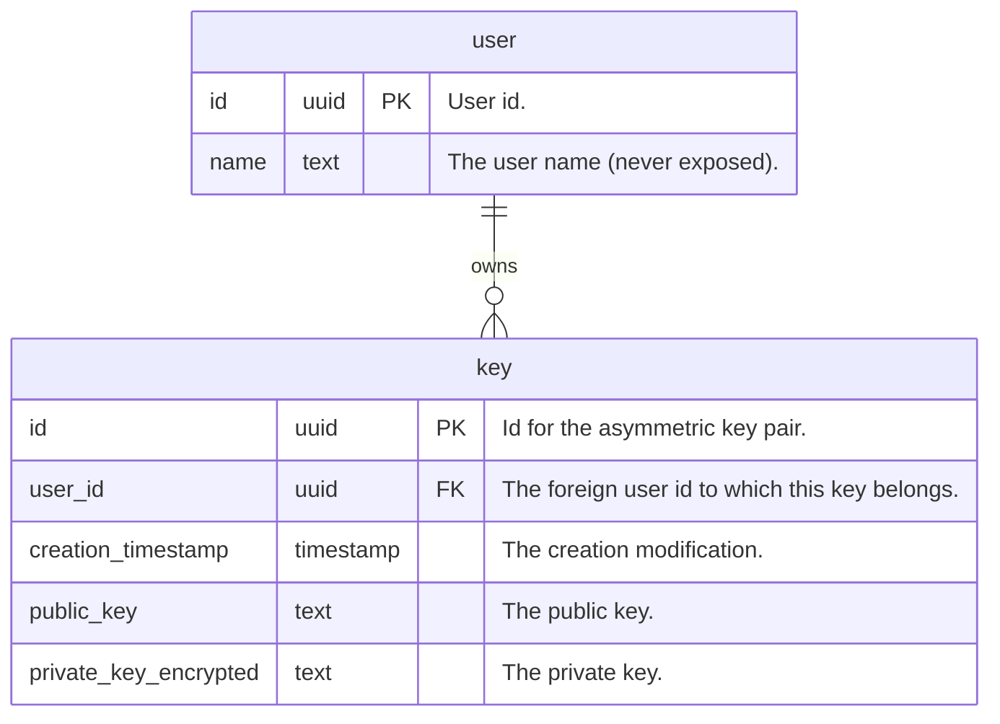

# Architecture

The following describes the architecture of the components `api` and the
involved other parts it interacts with. Not implemented parts in all diagrams
are marked with: ⚒ .

## Component Diagram

<div style="text-align:center">
    
</div>

Since the backend handles a very vulnerable part (maybe part of a larger
application), namely storing asymmetric keys, it is crucial to employ the
strictest security measures possible. The following interactions happen:

1. The `client` communicates with the backend over `HTTP/2.0` requests which are
   TLS encrypted (version >=`1.2`).

   - The client should only store the keys it interacts with in physical memory
     and only decrypt the private key when really needed. We treat the CLI
     application here as a client which might have the same runtime life-time as
     a corresponding web application.

   - The client does not log in anyway the key pairs it interacts with.

   - In case of the CLI:

     - it handles exit codes properly (an absolutely horrifiying example would
       be JFrogs Artifactory CLI `jf`).
     - it tries to either prompt the user to enter the encryption token for the
       private key generation or it reads it from a file (argument
       `--encryption-token <file>`) to avoid leaking anything to the process
       listing (e.g. `ps`).

   - It generates asymmetric keys as
     [described here](#asymmetric-key-generation).

2. The entry point in the backend consists of a `firewall` [⚒] which handles:

   - threat prevention (e.g.against denial-of-service (DDoS) attacks)
   - access control (VPN etc. (?))
   - application layer filtering etc.

3. A `reverse proxy` [⚒] (e.g. `nginx`) receives the requests and handles user
   authentication such that the `api`-service can focus on its relevant tasks
   and does not need to to do authentication again.

4. The `api`-service is scaled by multiple instances (depending on the load
   etc.) and handles these [endpoints](#endpoints-on-api-service).

   - The `api` is dumb and only validates the keys it receives and then stores
     them into the `database` (e.g. `PostgreSQL`) under the user id and given
     key id. The user id is of type UUID Version 4 which increases security. The
     same holds for the key id.

   - The private keys are already encrypted and the `api` has no knowledge of
     the encryption token given to the `client` to possibly decrypt them.

5. The database should generally only allow encrypted connections over TLS. This
   means to configure the [`postgresdb`](../manifests/postgresdb) to use TLS
   with certificates [⚒].

## Endpoints on `api`-Service

The following endpoints with base URL `api/` are implemented in
[`handlers.rs`](../components/api/handlers.rs):

_TODO: This section could be auto generated._

### `PUT` **`api/v1/user/{user_id}/store/{key_id}`**:

- **Description**: Stores the public and encrypted private keys under user id
  `user_id`. The key id must not exist already.

- **Method**: `PUT`
- **Parameters**:

  - `user_id`: The user id [`uuid`].
  - `key_id` : The key id [`uuid`].

- **Request Body**: [`json`]

  ```json
  {
      "version" = "1"
      "public_key" = "..."
      "private_key_encrypted" = "..."
  }
  ```

- Responses:

  - Status `200` if the key pair was created.
  - Status `403` if the key id `key_id` already exists.

### `DELETE` **`api/v1/user/{user_id}/store/{key_id}`**:

- **Method**: `DELETE`
- **Parameters**:

  - `user_id`: The user id [`uuid`].
  - `key_id` : The key id [`uuid`].

- Responses:

  - Status `200` if the key pair was deleted (may have not existed).

### `GET` **`api/v1/user/{user_id}/store/{key_id}`**:

- **Description**: Gets the public and encrypted private key for key id `key_id`
  of user `user_id`. If it does not exists.

- **Method**: `GET`
- **Parameters**:

  - `user_id`: The user id [`uuid`].
  - `key_id` : The key id [`uuid`].

- **Response Body**: [`json`]

  ```json
  {
      "version" = "1"
      "public_key" = "..."
      "private_key_encrypted" = "..."
  }
  ```

- Responses:
  - Status `200` if the key pair exists and was returned.
  - Status `403` if the user `user_id` does not exist.
  - Status `404` if the key pair for `key_id` was not found.

### `GET` **`api/v1/user/{user_id}/store/{key_id}/public`**:

- **Description**: Gets the public key for key id `key_id` of user `user_id`. If
  it does not exists.

- **Method**: `GET`
- **Parameters**:

  - `user_id`: The user id [`uuid`].
  - `key_id` : The key id [`uuid`].

- **Response Body**: [`json`]

  ```json
  {
      "version" = "1"
      "public_key" = "..."
  }
  ```

- Responses:
  - Status `200` if the key pair exists and was returned.
  - Status `403` if the user `user_id` does not exist.
  - Status `404` if the key pair for `key_id` was not found.

## Database Tables

The data base persists key pairs `key` in the `keys` table and users `user` in
the `users` table. Both tables are in normal form 3. The entity relationship
diagram looks as follows:



## Asymmetric Key Generation

Asymmetric key generation can be done with GPG which offers a vast variety of
encryption (RSA, DSA, AES and others).

This project wouldn't be fun if not questioning this tool and not using
something simpler and more elegant. With my very immature knowledge about
cryptography I cannot judge proficiently if the chosen tool might be a good fit.

However I can only summarize findings/pro/contras from research done by other
people.

In my
[dotfiles](https://github.com/gabyx/dotfiles/blob/main/config/dot_config/gnupg/encrypted_gabyx-private.asc.age)
I came across [`age`](https://github.com/FiloSottile/age) to encrypt my private
GPG key for signing Git commits. The tool
[`age`](https://github.com/FiloSottile/age) is simple, modern and uses strong
modern encryption algorithm `X25519` which is an elliptic curve encryption.
Elliptic curve encryption is based (loosely speaking and very rough) on the fact
that tangent-intersection iterations on that curve are impossible to backtrack
in the sense that you can compute, given a point on the curve, how many
iterations (private number in the modulo arithmetic) were needed to end up at
this point.
